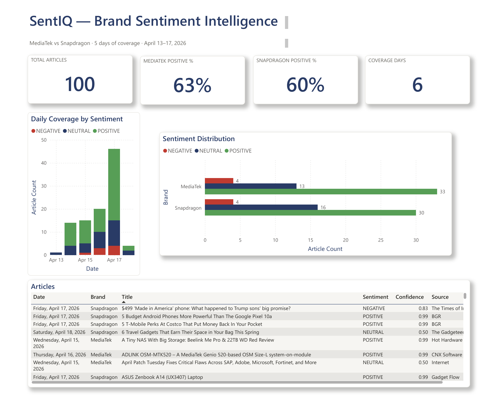

# SentIQ

Brand sentiment monitoring from live news. Compare how the media covers different brands, track sentiment day by day, and get an AI-generated summary explaining what's driving the results.

**Live:** https://web-production-c4ea8.up.railway.app


> **Note on the live demo:** the deployed app uses NewsAPI's free tier, which is capped at **100 requests per 24 hours**. Each analysis consumes 2 requests (one per brand). During heavy testing or if multiple reviewers hit the app in a short window, the quota can be exhausted — when that happens the app returns a rate-limit error until the next 12-hour half-reset. If you see a "Something went wrong" message on the demo, that's the most likely cause. The code, dashboard, and logic are unaffected — only the upstream data source is gated.

---

## Overview

SentIQ pulls news articles from NewsAPI, classifies each one as positive/negative/neutral using a keyword-based NLP engine, then surfaces the results through a dashboard. It also uses Groq's LLaMA 3.1 to generate a plain-English insight summary explaining what's driving sentiment for each brand.

Supports multi-brand comparison, statistical A/B testing (Welch's t-test + p-value), a daily coverage-by-sentiment chart, PDF/CSV export, user accounts, and email alerting.

Built with Flask on the backend and vanilla JS on the frontend — no frontend framework, no build step.

---

## Features

- Compare up to 6 brands side by side
- KPI cards with 3-segment positive/neutral/negative bars and coverage warnings
- Daily coverage chart showing article volume stacked by sentiment category
- 3-day weighted rolling smoothing so noisy low-volume days don't distort the view
- Statistical significance test between two brands (Welch's t-test)
- AI-generated insight summary powered by Groq LLaMA 3.1 — constrained to describe only what the data actually shows
- One-click PDF report and CSV export
- User accounts with persistent search history
- Email alerts when sentiment drops below a threshold
- Full password reset flow via email

---

## Power BI companion dashboard



An analyst-facing Power BI dashboard that mirrors the web app's analysis in an executive-report format. Built with six custom DAX measures (Article Count, Positive %, Coverage Days, Positive/Negative/Neutral Count, Sentiment Share), a custom theme matching the web app's colors, and four core visuals: KPI cards, a daily coverage stacked column chart, a sentiment distribution clustered bar chart, and a drill-down articles table.

To explore the dashboard:

1. Open `SentIQ.pbix` in Power BI Desktop
2. If prompted about the data source, re-point it to `sample-data.csv` in this folder
3. Click **Refresh**

Or [download as PDF](SentIQ-dashboard.pdf) for a read-only view.

The sample CSV is the result of a MediaTek vs Snapdragon analysis from the live web app. Regenerate with any brand pair by running an analysis and downloading a fresh CSV via the web app's export button.

---

## Tech

| | |
|---|---|
| Backend | Python 3, Flask |
| Database | SQLite via SQLAlchemy (dev) / Postgres (production) |
| Auth | Flask-Login, Werkzeug |
| Sentiment | Keyword NLP (no external API) |
| LLM | Groq LLaMA 3.1 8B Instant |
| News | NewsAPI |
| Statistics | scipy, pandas |
| Email | Flask-Mail + Gmail SMTP |
| Scheduler | APScheduler |
| PDF | ReportLab |
| Charts | Chart.js 4.4 |
| Analyst view | Power BI Desktop (custom DAX, themed visuals) |
| Hosting | Railway |

---

## Local setup

**Requirements:** Python 3.10+, a NewsAPI key, Gmail with App Password, Groq API key

```bash
git clone https://github.com/ValentineV-webarc/sentiq.git
cd sentiq
pip install -r requirements.txt
```

Set your credentials in `sentiq_app.py`:

```python
API_KEY = os.environ.get('NEWS_API_KEY', '<your-newsapi-key>')
GROQ_API_KEY = os.environ.get('GROQ_API_KEY', '<your-groq-key>')
app.config['MAIL_USERNAME'] = '<your-gmail>'
app.config['MAIL_PASSWORD'] = '<your-app-password>'
```

> **NewsAPI key:** Sign up free at [newsapi.org](https://newsapi.org)
>
> **Groq API key:** Get one free at [console.groq.com](https://console.groq.com)
>
> **Gmail App Password:** Google Account → Security → 2-Step Verification → App passwords

```bash
python sentiq_app.py
# → http://localhost:5000
```

DB is created automatically on first run.

---

## Project layout

```
sentiq/
├── sentiq_app.py     # all backend logic — routes, models, sentiment, LLM, email, PDF
├── requirements.txt
├── Procfile          # gunicorn config for Railway
└── templates/
    └── index.html    # full frontend — HTML + CSS + JS in one file
```

---

## Environment variables

| Variable | Description |
|---|---|
| `SECRET_KEY` | Flask session secret |
| `NEWS_API_KEY` | NewsAPI key |
| `GROQ_API_KEY` | Groq LLaMA API key |
| `MAIL_USERNAME` | Gmail address used to send emails |
| `MAIL_PASSWORD` | Gmail App Password |
| `APP_URL` | Public app URL — used in password reset links |

---

## Deploying

Deployed on Railway. Auto-deploys on push to `main`.

```
1. Push to GitHub
2. New project on railway.app → Deploy from GitHub repo
3. Add environment variables (see above)
4. Set APP_URL to your Railway domain after first deploy
```

---

## API

```
# Analysis
POST  /api/analyse              { brands: [...], limit: int, days?: int, from?: date, to?: date }
POST  /api/export/pdf           { ...analyse response }

# Auth
POST  /auth/register            { name, email, password }
POST  /auth/login               { email, password }
POST  /auth/logout
GET   /auth/me
POST  /auth/forgot-password     { email }
POST  /auth/reset-password      { token, password }

# History (auth required)
GET    /api/history
DELETE /api/history/:id
POST   /api/history/:id/alert   { alert_email, threshold }
DELETE /api/history/:id/alert
POST   /api/history/:id/alert/test
```

---

## Notes

### NewsAPI free tier limitations

This project runs on NewsAPI's developer (free) tier, which has several real constraints worth naming:

- **100 requests per rolling 24-hour window.** Each analysis uses 2 requests (one per brand). The quota resets in halves — 50 requests come back roughly 12 hours after first being consumed, the remaining 50 at 24 hours. A short burst of testing can exhaust the budget and lock the app until the reset.
- **Articles cluster near the present.** Even when you request articles from a 7-day window, NewsAPI's free tier prioritises the last 24–48 hours and returns very few older articles. The dashboard handles this honestly: the KPI cards flag "limited coverage" when a brand's articles span fewer days than requested, rather than silently pretending the trend is complete.
- **30-day historical depth.** Older articles aren't accessible on this tier. The app caps date queries accordingly.
- **Rate-limit behaviour.** When quota is exhausted, the app shows a "Something went wrong" banner rather than crashing. Analysis requests fail gracefully, existing results stay on screen, and the limit resets automatically.

### Other notes

- Groq free tier has generous rate limits — sufficient for demo and regular usage.
- Alerts run on a 1-hour scheduler, so the first trigger after configuring one can take up to an hour.
- Sentiment accuracy is lower than a fine-tuned transformer but sufficient for brand-level aggregate comparisons. A production version would use DistilBERT or similar.

---

## Author

Valentine Virgo
https://github.com/ValentineV-webarc
