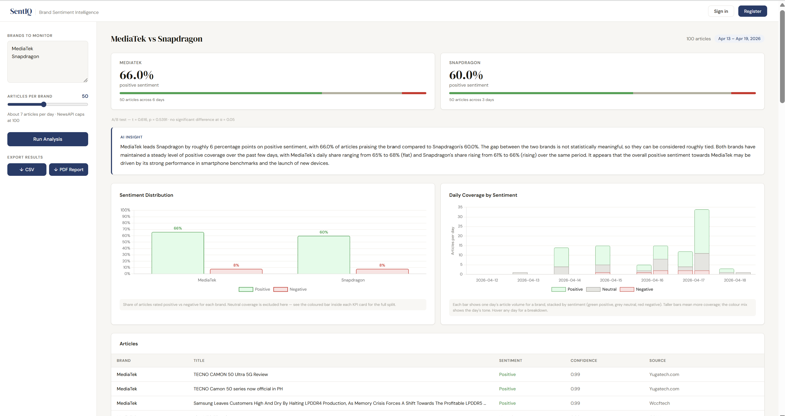

# SentIQ

Brand sentiment monitoring from live news. Compare how the media covers different brands, track sentiment over time, and get alerted when things shift.

**Live:** https://sentiq-production-251e.up.railway.app

---

## Overview


SentIQ pulls news articles from NewsAPI, classifies each one as positive/negative/neutral using a keyword-based NLP engine, then surfaces the results through a dashboard. Supports multi-brand comparison, statistical A/B testing (t-test + p-value), trend charts, PDF/CSV export, user accounts, and email alerting.

Built with Flask on the backend and vanilla JS on the frontend — no frontend framework, no build step.

---

## Features

- Compare up to 6 brands side by side
- Sentiment distribution + day-by-day trend chart
- Statistical significance test between two brands
- One-click PDF report and CSV export
- User accounts with persistent search history
- Email alerts when sentiment drops below a threshold
- Full password reset flow via email

---

## Tech

| | |
|---|---|
| Backend | Python 3, Flask |
| Database | SQLite via SQLAlchemy |
| Auth | Flask-Login, Werkzeug |
| Sentiment | Keyword NLP (no external API) |
| News | NewsAPI |
| Email | Flask-Mail + Gmail SMTP |
| Scheduler | APScheduler |
| PDF | ReportLab |
| Charts | Chart.js |
| Hosting | Railway |

---

## Local setup

**Requirements:** Python 3.9+, a NewsAPI key, Gmail with App Password enabled

```bash
git clone https://github.com/ValentineV-webarc/sentiq.git
cd sentiq
pip install -r requirements.txt
```

Set your credentials in `sentiq_app.py`:

```python
API_KEY = os.environ.get('NEWS_API_KEY', '<your-newsapi-key>')
app.config['MAIL_USERNAME'] = '<your-gmail>'
app.config['MAIL_PASSWORD'] = '<your-app-password>'  # not your Gmail login password
```

> To get a Gmail App Password: Google Account → Security → 2-Step Verification → App passwords.

```bash
python sentiq_app.py
# → http://localhost:5000
```

DB is created automatically on first run.

---

## Project layout

```
sentiq/
├── sentiq_app.py     # all backend logic — routes, models, sentiment, email, PDF
├── requirements.txt
├── Procfile          # gunicorn config for Railway
└── templates/
    └── index.html    # full frontend — HTML + CSS + JS in one file
```

---

## Environment variables

Used in production. Fallback defaults are set in `sentiq_app.py` for local dev.

| Variable | Description |
|---|---|
| `SECRET_KEY` | Flask session secret |
| `NEWS_API_KEY` | NewsAPI key |
| `MAIL_USERNAME` | Gmail address used to send emails |
| `MAIL_PASSWORD` | Gmail App Password |
| `APP_URL` | Public app URL — used in password reset links |

---

## Deploying

Deployed on Railway. Auto-deploys on push to `main`.

```
1. Push to GitHub
2. New project on railway.app → Deploy from GitHub repo
3. Add environment variables (see above)
4. Set APP_URL to your Railway domain after first deploy
```

---

## API

```
# Analysis
POST  /api/analyse              { brands: [...], limit: int }
POST  /api/export/pdf           { ...analyse response }

# Auth
POST  /auth/register            { name, email, password }
POST  /auth/login               { email, password }
POST  /auth/logout
GET   /auth/me
POST  /auth/forgot-password     { email }
POST  /auth/reset-password      { token, password }

# History (auth required)
GET    /api/history
DELETE /api/history/:id
POST   /api/history/:id/alert   { alert_email, threshold }
DELETE /api/history/:id/alert
POST   /api/history/:id/alert/test

# Debug
GET   /api/test                 checks NewsAPI + sentiment engine
```

---

## Notes

- NewsAPI free tier is developer-only — production traffic may hit rate limits
- Alerts run on a 1-hour scheduler, so first trigger can take up to an hour
- Trend chart needs articles from multiple days to be meaningful — use limit 100 for better coverage
- Sentiment accuracy is lower than a fine-tuned model but good enough for brand-level comparisons at scale

---

## Author

Valentine Virgo
https://github.com/ValentineV-webarc
